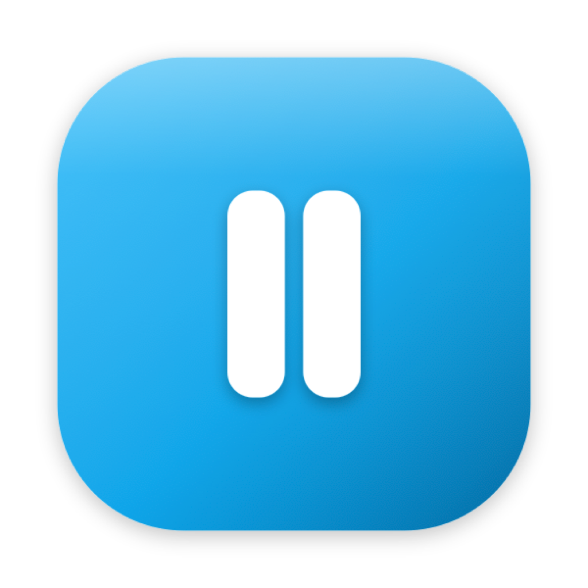

<p align="center">
  
</p>

<h1 align="center">Pausa</h1>

<p align="center">
  A native-feeling macOS break reminder for developers and knowledge workers.
  <br>
  Built with Go, Wails, AppKit, and Vue.
</p>

<p align="center">
  <a href="#features">Features</a> •
  <a href="#how-it-works">How It Works</a> •
  <a href="#installation">Installation</a> •
  <a href="#development">Development</a> •
  <a href="#configuration">Configuration</a>
</p>

```bash
brew tap yuseferi/pausa https://github.com/yuseferi/pausa
brew install --cask pausa
```

---

## Features

### Break scheduling
- Short breaks and long breaks with fully configurable intervals and durations
- Postpone, skip, pause/resume, and take-a-break-now controls
- Working-hours support so breaks only fire during the days/times you choose
- Natural-break detection so real away-from-keyboard time can count as a break

### Busy-aware auto-pause
- Automatically pauses the countdown while you're busy so that time is **not** counted toward break timing
- Detects:
  - microphone in use for meetings and calls
  - system now-playing/media playback
  - sustained audio output for apps that don't publish now-playing state
  - frontmost browser video/meeting pages, including muted YouTube and Google Meet
- Resumes automatically when you're free again

### Fullscreen and multi-monitor overlays
- Native macOS `NSPanel` overlays render on top of fullscreen-app Spaces
- Can cover every monitor or only the active screen
- Fullscreen mode or compact centered-card mode
- Overlay actions: Skip and Postpone

### Wellness guidance
- Eye, stretch, move, and breathing tips during breaks
- Breathing guide for long breaks
- Long-break progress indicator and simple daily stats

### Native macOS integration
- Menu-bar-first app with native status item and dynamic icon state
- Native notifications with action buttons
- Restores focus back to the previous app after breaks, including fullscreen apps

---

## How It Works

Pausa is macOS-first.

- The **scheduler** is a single-goroutine actor with a tested state machine
- The **frontend** is Vue, used for the dashboard and preferences
- The **break UI** shown during active breaks is rendered through native AppKit overlay panels so it can appear above fullscreen-app Spaces
- The **busy detection** pipeline combines microphone, now-playing, audio-output, and browser-tab heuristics

Architecture details live in [`ARCHITECTURE.md`](ARCHITECTURE.md).

---

## Installation

### Homebrew

Pausa is distributed as a Homebrew **cask** (the correct Homebrew model for a macOS `.app` bundle):

```bash
brew tap yuseferi/pausa https://github.com/yuseferi/pausa
brew install --cask pausa
```

If the tap is already added:

```bash
brew install --cask pausa
```

### Unsigned app note

Pausa is currently distributed as an **unsigned / non-notarized** app bundle.
That means macOS may block the first launch with a Gatekeeper warning.

If that happens, either:

1. Open it once from Finder using **right-click → Open**, or
2. Remove the quarantine attribute manually:

```bash
xattr -dr com.apple.quarantine /Applications/pausa.app
open /Applications/pausa.app
```

This is the current free-distribution path. A paid Apple Developer account
would be required for proper notarized distribution.

### Build from source

Prerequisites:
- Go 1.25+
- Node.js 18+
- Wails v2 CLI
- Xcode Command Line Tools

```bash
git clone git@github.com:yuseferi/pausa.git
cd pausa

go install github.com/wailsapp/wails/v2/cmd/wails@latest
wails build
```

The built app will be at:

```bash
build/bin/pausa.app
```

### Run the built app

```bash
open build/bin/pausa.app
```

### Install the built app locally

To copy the freshly built app into `/Applications` on your current Mac:

```bash
make install-local
```

This will:
- run a fresh production build
- replace `/Applications/pausa.app`

If macOS blocks first launch because the app is unsigned:

```bash
xattr -dr com.apple.quarantine /Applications/pausa.app
open /Applications/pausa.app
```

---

## Development

### Start development mode

```bash
wails dev
```

### Local release helper

To prepare both macOS release zips locally and automatically update
`Casks/pausa.rb` with the new version and checksums:

```bash
scripts/release.sh 1.0.2
```

Or via `make`:

```bash
make release VERSION=1.0.2
```

This builds:
- `dist/pausa-1.0.2-arm64-macos.zip`
- `dist/pausa-1.0.2-amd64-macos.zip`

and rewrites `Casks/pausa.rb` for you.

### Automatic releases

Pausa now uses **semantic-release** on `main`.

That means:
- release version is chosen automatically from commit messages
- git tags are created automatically
- GitHub releases are created automatically
- the macOS asset workflow then builds and uploads the release zips for both architectures

Use **Conventional Commits** for anything that should affect releases:

```text
feat: add muted browser video detection
fix: pause scheduler while media is playing
docs: update Homebrew install instructions
```

Versioning rules:
- `fix:` -> patch release
- `feat:` -> minor release
- `feat!:` or `BREAKING CHANGE:` -> major release

### Recommended clean restart

Because `wails dev` may keep an old Go/cgo process alive while frontend assets hot-reload, a clean restart is sometimes useful when working on native macOS code:

```bash
pkill -9 pausa
go clean -cache
wails dev
```

### Debug logging

Pausa supports runtime log levels through `PAUSA_LOG_LEVEL`:

```bash
PAUSA_LOG_LEVEL=debug wails dev
```

Useful values:
- `debug`
- `info`
- `warn`
- `error`

Logs are also written to:

```bash
~/Library/Logs/Pausa/pausa.log
```

---

## Configuration

Configuration is stored at:

```bash
~/Library/Application Support/Pausa/config.json
```

### Key settings

#### Schedule
- `shortInterval`
- `shortDuration`
- `longEvery`
- `longDuration`
- `postponeShort`
- `postponeLong`

#### Notifications
- pre-break notifications
- warning timings for short and long breaks
- action buttons

#### Display
- theme
- fullscreen break overlays
- all-monitors overlays
- exercise tips
- breathing guide
- accent color

#### Working hours
- enabled/disabled
- weekdays
- start and end time

#### Idle and busy behavior
- pause when idle
- idle threshold
- natural breaks
- pause during meetings and videos
- media debounce for audio-output fallback

---

## Busy Detection Details

Pausa currently uses these signals to auto-pause the scheduler:

1. **Microphone active**
   - catches Meet, Zoom, Teams, Discord, Slack huddles, browser calls, dictation, etc.

2. **Now Playing**
   - catches apps/browsers that publish system media state

3. **Audio output activity**
   - fallback for apps that don't publish now-playing state
   - debounced so short notification sounds don't pause the timer

4. **Frontmost browser tab URL heuristic**
   - catches muted frontmost video/meeting pages such as YouTube and Google Meet

Current browser-tab support:
- Chrome
- Arc
- Safari
- Brave

Current frontmost URL matches:
- YouTube
- Google Meet
- Netflix
- Vimeo
- Twitch
- Disney+
- Hulu
- Prime Video
- Loom share/embed pages

This browser heuristic is currently **frontmost-browser only**. Background muted tabs are not treated as busy yet.

---

## Display Modes

### Fullscreen breaks
- **On**: edge-to-edge overlay panels on the target screen(s)
- **Off**: centered compact card panels

### Show on all monitors
- **On**: every connected screen gets an overlay
- **Off**: only the screen containing the mouse cursor gets an overlay

The overlay system is native AppKit, not a regular Wails window, so it works on fullscreen-app Spaces.

---

## Project Structure

```text
pausa/
├── main.go
├── ARCHITECTURE.md
├── internal/
│   ├── breakapp/      # Wails-bound app facade
│   ├── clock/         # clock + fake clock for tests
│   ├── config/        # config model + persistence
│   ├── log/           # slog logger setup
│   ├── macos/         # AppKit / CoreAudio / MediaRemote bridge
│   ├── scheduler/     # actor-based break scheduler + tests
│   └── tips/          # wellness tips catalog
├── frontend/
│   └── src/
│       ├── lib/       # api + reactive store
│       ├── views/     # dashboard, break, preferences, welcome
│       ├── components/
│       └── composables/
└── build/
    └── icons/
```

---

## Testing

Backend verification:

```bash
go build ./...
go vet ./...
go test -race ./...
```

Frontend build:

```bash
cd frontend
npm run build
```

Cross-platform compile sanity:

```bash
GOOS=linux CGO_ENABLED=0 go build ./...
```

The app is macOS-focused, but non-darwin stubs are kept so cross-compilation still works.

---

## Current Limitations

- Busy browser-video detection for muted tabs is currently **frontmost-tab only**
- Linux and Windows are not implemented as real targets yet
- Some media detection relies on Apple-private APIs (`MediaRemote`) and browser scripting fallbacks

---

## Roadmap Ideas

- Background browser-tab media detection
- Firefox browser support for muted-tab detection
- Richer stats/history view
- More configurable break styles and sounds
- Release packaging and codesigning workflow

---

## Repository

- GitHub: <https://github.com/yuseferi/pausa>
- Issues: <https://github.com/yuseferi/pausa/issues>
