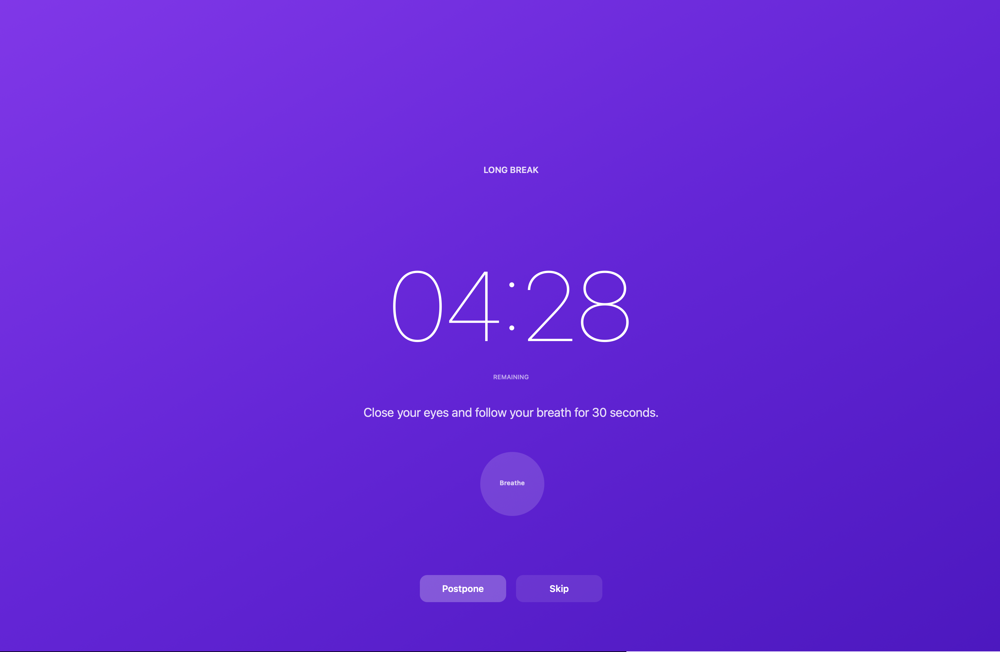
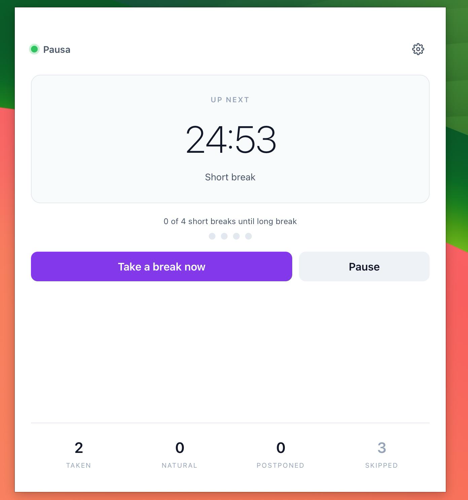
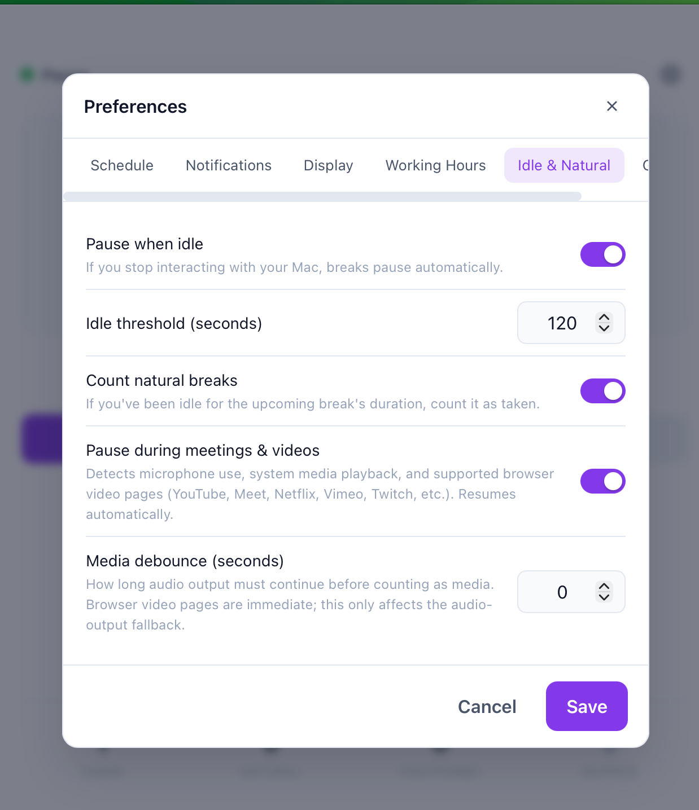
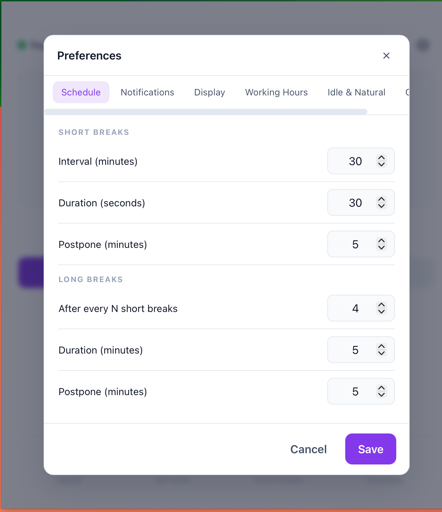

<p align="center">
  
</p>

<h1 align="center">Pausa</h1>

<p align="center">
  <strong>A thoughtful, native macOS break reminder for developers and knowledge workers.</strong>
  <br>
  Take better breaks. Stay focused in between.
  <br><br>
  Built with Go, Wails, AppKit, and Vue.
</p>

<p align="center">
  <a href="#features">Features</a> &middot;
  <a href="#how-it-works">How It Works</a> &middot;
  <a href="#installation">Installation</a> &middot;
  <a href="#development">Development</a> &middot;
  <a href="#configuration">Configuration</a>
</p>

<p align="center">
  
</p>

## Quick Start

```bash
brew tap yuseferi/pausa https://github.com/yuseferi/pausa
brew install --cask pausa
```

That's it. Pausa lives in your menu bar and gently reminds you to take breaks throughout the day.

---

## Features

### Break Scheduling

- **Short and long breaks** with fully configurable intervals and durations
- **Flexible controls** -- postpone, skip, pause/resume, or take a break right now
- **Working-hours support** so breaks only fire during the days and times you choose
- **Natural-break detection** so real away-from-keyboard time counts as a break

### Smart Busy Detection

Pausa automatically pauses the countdown while you're busy, so meeting time is never counted toward your next break. It detects:

- Microphone activity (meetings, calls, huddles)
- System media playback (Now Playing)
- Sustained audio output for apps that don't publish media state
- Frontmost browser video and meeting pages, including muted YouTube and Google Meet

The timer resumes automatically when you're free again.

### Fullscreen and Multi-Monitor Overlays

- Native macOS `NSPanel` overlays that render on top of fullscreen Spaces
- Option to cover every monitor or only the active screen
- Choose between fullscreen mode or a compact centered card
- Overlay actions: Skip and Postpone

### Wellness Guidance

- Eye, stretch, movement, and breathing tips during breaks
- Guided breathing exercise for long breaks
- Long-break progress indicator and simple daily stats

### Native macOS Integration

- Menu-bar-first design with a native status item and dynamic icon
- Native notifications with action buttons
- Automatically restores focus to your previous app after breaks, including fullscreen apps

---

## How It Works

Pausa is built from the ground up for macOS.

- The **scheduler** is a single-goroutine actor backed by a tested state machine
- The **frontend** is Vue, powering the dashboard and preferences UI
- The **break overlay** is rendered through native AppKit panels so it can appear above fullscreen Spaces
- The **busy-detection pipeline** combines microphone, Now Playing, audio-output, and browser-tab heuristics

For a deeper look at the architecture, see [`ARCHITECTURE.md`](ARCHITECTURE.md).

---

## Screenshots

### Dashboard

<p align="center">
  
</p>

### Preferences

<p align="center">
  
</p>

<p align="center">
  
</p>

---

## Installation

### Homebrew (Recommended)

Pausa is distributed as a Homebrew **cask**, which is the standard Homebrew model for macOS `.app` bundles:

```bash
brew tap yuseferi/pausa https://github.com/yuseferi/pausa
brew install --cask pausa
```

If the tap is already added:

```bash
brew install --cask pausa
```

### Gatekeeper Note

Pausa is currently distributed as an **unsigned / non-notarized** app. macOS may show a Gatekeeper warning on first launch.

To resolve this, either:

1. Right-click the app in Finder and choose **Open**, or
2. Remove the quarantine attribute from the terminal:

```bash
xattr -dr com.apple.quarantine /Applications/pausa.app
open /Applications/pausa.app
```

> A properly notarized build requires a paid Apple Developer account. This is planned for a future release.

### Build from Source

**Prerequisites:**

- Go 1.25+
- Node.js 18+
- [Wails v2 CLI](https://wails.io/)
- Xcode Command Line Tools

```bash
git clone https://github.com/yuseferi/pausa.git
cd pausa

go install github.com/wailsapp/wails/v2/cmd/wails@latest
wails build
```

The built app will be at `build/bin/pausa.app`.

**Run it:**

```bash
open build/bin/pausa.app
```

**Install locally to `/Applications`:**

```bash
make install-local
```

This runs a fresh production build and replaces `/Applications/pausa.app`. If macOS blocks the first launch, use the `xattr` command shown above.

---

## Development

### Start Development Mode

```bash
wails dev
```

### Debug Logging

Pausa supports runtime log levels via the `PAUSA_LOG_LEVEL` environment variable:

```bash
PAUSA_LOG_LEVEL=debug wails dev
```

Available levels: `debug`, `info`, `warn`, `error`

Logs are also written to:

```
~/Library/Logs/Pausa/pausa.log
```

### Clean Restart

Because `wails dev` may keep a stale Go/cgo process alive while front-end assets hot-reload, a clean restart is sometimes helpful when working on native macOS code:

```bash
pkill -9 pausa
go clean -cache
wails dev
```

### Local Release Helper

To prepare both macOS release zips locally and automatically update `Casks/pausa.rb` with the new version and checksums:

```bash
scripts/release.sh 1.0.2
# or
make release VERSION=1.0.2
```

This builds:

- `dist/pausa-1.0.2-arm64-macos.zip`
- `dist/pausa-1.0.2-amd64-macos.zip`

and rewrites `Casks/pausa.rb` for you.

### Automatic Releases

Pausa uses **semantic-release** on the `main` branch. Release versions, git tags, and GitHub releases are created automatically from commit messages. The macOS asset workflow then builds and uploads release zips for both architectures.

Use [Conventional Commits](https://www.conventionalcommits.org/) for anything that should trigger a release:

| Prefix | Release Type |
|---|---|
| `fix:` | Patch |
| `feat:` | Minor |
| `feat!:` or `BREAKING CHANGE:` | Major |

```text
feat: add muted browser video detection
fix: pause scheduler while media is playing
docs: update Homebrew install instructions
```

---

## Configuration

Configuration is stored at:

```
~/Library/Application Support/Pausa/config.json
```

All settings are editable through the Preferences UI. Key options include:

| Category | Settings |
|---|---|
| **Schedule** | Short/long break intervals and durations, postpone durations |
| **Notifications** | Pre-break warnings, timing, action buttons |
| **Display** | Theme, fullscreen overlays, all-monitors mode, exercise tips, breathing guide, accent color |
| **Working Hours** | Enable/disable, weekday selection, start and end times |
| **Idle & Busy** | Pause when idle, idle threshold, natural breaks, meeting/video detection, media debounce |

---

## Busy Detection in Detail

Pausa uses multiple signals to automatically pause the break timer while you're occupied:

| Signal | What It Catches |
|---|---|
| **Microphone active** | Meet, Zoom, Teams, Discord, Slack huddles, browser calls, dictation |
| **Now Playing** | Apps and browsers that publish system media state |
| **Audio output activity** | Fallback for apps that don't publish Now Playing (debounced to ignore short sounds) |
| **Browser tab URL heuristic** | Muted frontmost video/meeting pages (YouTube, Google Meet, Netflix, Vimeo, Twitch, Disney+, Hulu, Prime Video, Loom) |

**Supported browsers:** Chrome, Arc, Safari, Brave

> Note: Browser detection currently applies to the **frontmost tab only**. Background muted tabs are not treated as busy.

---

## Display Modes

| Setting | On | Off |
|---|---|---|
| **Fullscreen breaks** | Edge-to-edge overlay on the target screen(s) | Compact centered card |
| **Show on all monitors** | Every connected screen gets an overlay | Only the screen with the mouse cursor |

The overlay system uses native AppKit panels (not regular Wails windows), so it works reliably on fullscreen Spaces.

---

## Project Structure

```text
pausa/
├── main.go
├── ARCHITECTURE.md
├── internal/
│   ├── breakapp/      # Wails-bound app facade
│   ├── clock/         # Clock abstraction (+ fake clock for tests)
│   ├── config/        # Config model and persistence
│   ├── log/           # slog logger setup
│   ├── macos/         # AppKit / CoreAudio / MediaRemote bridge
│   ├── scheduler/     # Actor-based break scheduler + tests
│   └── tips/          # Wellness tips catalog
├── frontend/
│   └── src/
│       ├── lib/       # API client + reactive store
│       ├── views/     # Dashboard, break, preferences, welcome
│       ├── components/
│       └── composables/
└── build/
    └── icons/
```

---

## Testing

**Backend:**

```bash
go build ./...
go vet ./...
go test -race ./...
```

**Frontend:**

```bash
cd frontend
npm run build
```

**Cross-platform compile check:**

```bash
GOOS=linux CGO_ENABLED=0 go build ./...
```

Pausa is macOS-focused, but non-darwin stubs are maintained so cross-compilation continues to work.

---

## Known Limitations

- Browser video detection for muted tabs is currently **frontmost-tab only**
- Linux and Windows are not supported as runtime targets yet
- Some media detection relies on Apple-private APIs (`MediaRemote`) and browser scripting fallbacks

---

## Roadmap

- Background browser-tab media detection
- Firefox support for muted-tab detection
- Richer stats and history view
- More configurable break styles and sounds
- Code signing and notarized distribution

---

## Contributing

Contributions, ideas, and bug reports are welcome. Please open an issue or pull request on [GitHub](https://github.com/yuseferi/pausa).

---

## Links

- **Repository:** <https://github.com/yuseferi/pausa>
- **Issues:** <https://github.com/yuseferi/pausa/issues>
