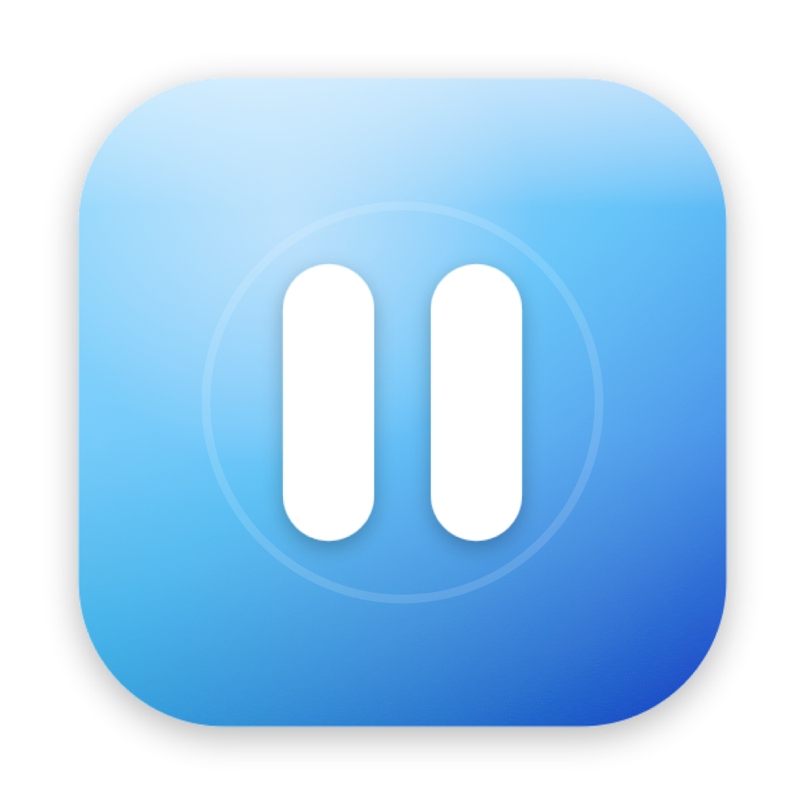
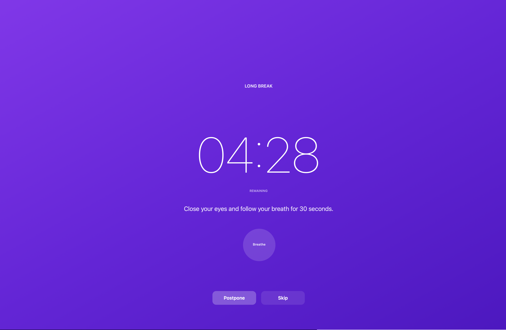
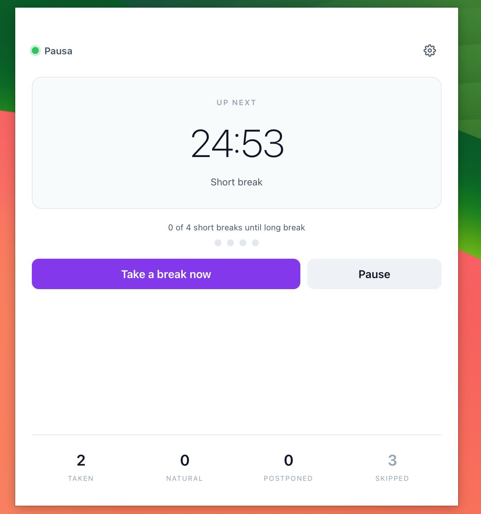
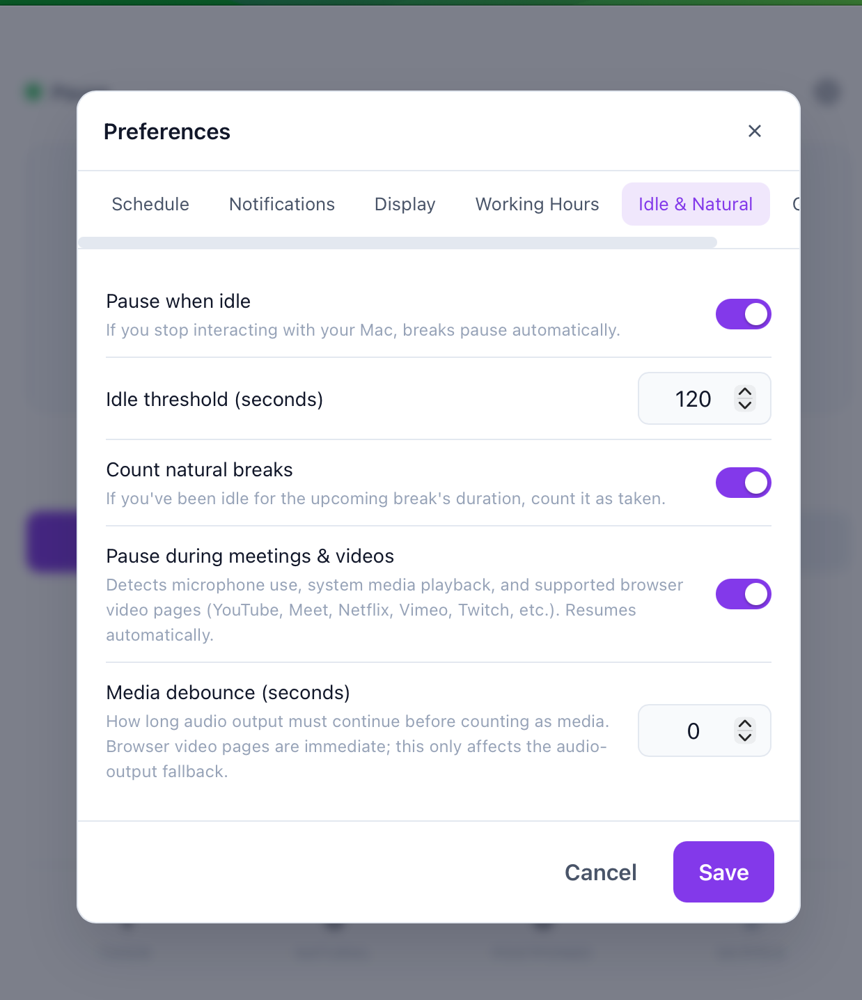
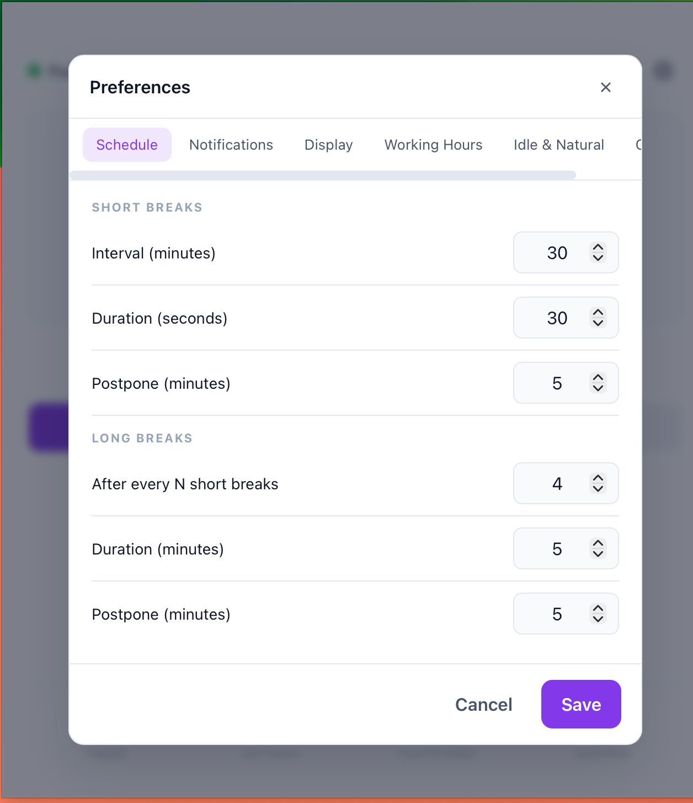

<p align="center">
  
</p>

<h1 align="center">Pausa</h1>

<p align="center">
  <strong>Break reminders that stay out of your way during meetings — and take over the whole screen when it's time to rest.</strong>
</p>

<p align="center">
  <a href="https://github.com/yuseferi/pausa/releases/latest"></a>
  <a href="https://github.com/yuseferi/pausa/blob/main/LICENSE"></a>
  
  <a href="https://github.com/yuseferi/pausa/actions/workflows/ci.yml"></a>
  <a href="https://github.com/yuseferi/pausa/stargazers"></a>
</p>

<p align="center">
  Native macOS menu-bar app · Built with Go, Wails, AppKit &amp; Vue · No account, no telemetry, everything local
</p>

<p align="center">
  <a href="https://yuseferi.github.io/pausa/">Website</a> &middot;
  <a href="#install">Install</a> &middot;
  <a href="#why-pausa">Why Pausa</a> &middot;
  <a href="#screenshots">Screenshots</a> &middot;
  <a href="#features">Features</a> &middot;
  <a href="#busy-detection-in-detail">Busy detection</a> &middot;
  <a href="#configuration">Configuration</a> &middot;
  <a href="#development">Development</a>
</p>

<p align="center">
  
</p>

## Install

Homebrew is the recommended path:

```bash
brew tap yuseferi/pausa https://github.com/yuseferi/pausa
brew install --cask pausa
```

Already tapped?

```bash
brew install --cask pausa
```

Prefer a direct download? Grab the latest `.zip` — Apple silicon and Intel builds are both published:

**<https://github.com/yuseferi/pausa/releases/latest>**

> **First launch:** Pausa is not notarized yet, so macOS may show a Gatekeeper warning. Right-click the app → **Open**, or clear the quarantine flag:
>
> ```bash
> xattr -dr com.apple.quarantine /Applications/pausa.app
> open /Applications/pausa.app
> ```
>
> Notarized builds need a paid Apple Developer account — it's on the roadmap.

That's it. Pausa lives in your menu bar and quietly keeps you on a healthy break rhythm.

---

## Why Pausa

Most break reminders fire at the wrong moment and are easy to ignore. Pausa is built around two ideas:

1. **Don't interrupt real work.** When you're in a call, playing media, or on a muted video tab, Pausa pauses the countdown automatically and resumes when you're free. Meeting time never counts toward your next break.
2. **Make breaks impossible to miss — and easy to take.** A native fullscreen panel covers fullscreen Spaces and every monitor, then returns focus to exactly where you were.

On top of that:

- **Respects your hours** — breaks only fire on the days and times you choose.
- **Counts natural breaks** — real away-from-keyboard time is credited, so you aren't nagged right after a walk.
- **Private by default** — no account, no telemetry, no network calls (see [Privacy](#privacy)).
- **Menu-bar native** — a small, responsive status item; it stays out of your Dock and out of your way.

---

## Screenshots

### Dashboard

<p align="center">
  
</p>

### Preferences

<p align="center">
  
</p>

<p align="center">
  
</p>

---

## Features

### Break Scheduling

- **Short and long breaks** with fully configurable intervals and durations
- **Flexible controls** — postpone, skip, pause/resume, or take a break right now
- **Working-hours support** so breaks only fire during the days and times you choose
- **Natural-break detection** so real away-from-keyboard time counts as a break

### Smart Busy Detection

Pausa automatically pauses the countdown while you're busy, so meeting time is never counted toward your next break. It detects:

- Microphone activity (meetings, calls, huddles)
- System media playback (Now Playing)
- Sustained audio output for apps that don't publish media state
- Frontmost browser video and meeting pages, including muted YouTube and Google Meet

The timer resumes automatically when you're free again. See [Busy Detection in Detail](#busy-detection-in-detail).

### Fullscreen and Multi-Monitor Overlays

- Native macOS `NSPanel` overlays that render on top of fullscreen Spaces
- Option to cover every monitor or only the active screen
- Choose between fullscreen mode or a compact centered card
- Overlay actions: Skip and Postpone

### Wellness Guidance

- Eye, stretch, movement, and breathing tips during breaks
- Guided breathing exercise for long breaks
- Long-break progress indicator and simple daily stats

### Native macOS Integration

- Menu-bar-first design with a native status item and dynamic icon
- Native notifications with action buttons
- Automatically restores focus to your previous app after breaks, including fullscreen apps

---

## How It Works

Pausa is built from the ground up for macOS.

- The **scheduler** is a single-goroutine actor backed by a tested state machine
- The **frontend** is Vue, powering the dashboard and preferences UI
- The **break overlay** is rendered through native AppKit panels so it can appear above fullscreen Spaces
- The **busy-detection pipeline** combines microphone, Now Playing, audio-output, and browser-tab heuristics

For a deeper look at the architecture, see [`ARCHITECTURE.md`](ARCHITECTURE.md).

---

## Busy Detection in Detail

Pausa uses multiple signals to automatically pause the break timer while you're occupied:

| Signal | What It Catches |
|---|---|
| **Microphone active** | Meet, Zoom, Teams, Discord, Slack huddles, browser calls, dictation |
| **Now Playing** | Apps and browsers that publish system media state |
| **Audio output activity** | Fallback for apps that don't publish Now Playing (debounced to ignore short sounds) |
| **Browser tab URL heuristic** | Muted frontmost video/meeting pages (YouTube, Google Meet, Netflix, Vimeo, Twitch, Disney+, Hulu, Prime Video, Loom) |

**Supported browsers:** Chrome, Arc, Safari, Brave

> Note: Browser detection currently applies to the **frontmost tab only**. Background muted tabs are not treated as busy.

---

## Display Modes

| Setting | On | Off |
|---|---|---|
| **Fullscreen breaks** | Edge-to-edge overlay on the target screen(s) | Compact centered card |
| **Show on all monitors** | Every connected screen gets an overlay | Only the screen with the mouse cursor |

The overlay system uses native AppKit panels (not regular Wails windows), so it works reliably on fullscreen Spaces.

---

## Configuration

Configuration is stored at:

```
~/Library/Application Support/Pausa/config.json
```

All settings are editable through the Preferences UI. Key options include:

| Category | Settings |
|---|---|
| **Schedule** | Short/long break intervals and durations, postpone durations |
| **Notifications** | Pre-break warnings, timing, action buttons |
| **Display** | Theme, fullscreen overlays, all-monitors mode, exercise tips, breathing guide, accent color |
| **Working Hours** | Enable/disable, weekday selection, start and end times |
| **Idle & Busy** | Pause when idle, idle threshold, natural breaks, meeting/video detection, media debounce |

---

## Privacy

Pausa runs entirely on your Mac:

- **No account** and no sign-in
- **No analytics or telemetry**
- **No network requests at runtime** — configuration and logs stay on disk
- **Busy detection is local** — it checks whether the microphone is *in use* (not the audio itself), system media state, and (only for the frontmost browser) the active tab URL. None of it leaves your machine.

---

## Requirements

- macOS (Apple silicon and Intel builds both published)
- Break overlays work best with the default accessory activation policy. If you enable **Show in Dock**, Pausa uses the regular activation policy, which can reduce its ability to cover fullscreen-app Spaces.

---

## FAQ

**Does Pausa need Accessibility or Screen Recording permission?**
No. It uses public system APIs plus a short, read-only AppleScript lookup for the frontmost browser's active tab URL. It never records your screen or keystrokes.

**Does it collect any data?**
No. There is no telemetry and no runtime network access — see [Privacy](#privacy).

**Will it interrupt me during a call?**
No. Microphone use auto-pauses the schedule, and the countdown resumes when the call ends.

**Why does macOS warn me on first launch?**
The build isn't notarized yet. Use the right-click → **Open** steps above; notarization is on the roadmap.

**Does it work with fullscreen apps?**
Yes. Break overlays are native panels that render above fullscreen Spaces, and can cover every monitor.

---

## Known Limitations

- Browser video detection for muted tabs is currently **frontmost-tab only**
- Linux and Windows are not supported as runtime targets yet
- Some media detection relies on Apple-private APIs (`MediaRemote`) and browser scripting fallbacks

---

## Roadmap

- Background browser-tab media detection
- Firefox support for muted-tab detection
- Richer stats and history view
- More configurable break styles and sounds
- Code signing and notarized distribution

Have an idea or a bug to report? [Open an issue](https://github.com/yuseferi/pausa/issues) — feature requests are welcome.

---

## Development

### Start Development Mode

```bash
wails dev
```

### Debug Logging

Pausa supports runtime log levels via the `PAUSA_LOG_LEVEL` environment variable:

```bash
PAUSA_LOG_LEVEL=debug wails dev
```

Available levels: `debug`, `info`, `warn`, `error`

Logs are also written to:

```
~/Library/Logs/Pausa/pausa.log
```

### Clean Restart

Because `wails dev` may keep a stale Go/cgo process alive while front-end assets hot-reload, a clean restart is sometimes helpful when working on native macOS code:

```bash
pkill -9 pausa
go clean -cache
wails dev
```

### Build from Source

**Prerequisites:**

- Go 1.25+
- Node.js 18+
- [Wails v2 CLI](https://wails.io/)
- Xcode Command Line Tools

```bash
git clone https://github.com/yuseferi/pausa.git
cd pausa

go install github.com/wailsapp/wails/v2/cmd/wails@latest
wails build
```

The built app will be at `build/bin/pausa.app`.

**Run it:**

```bash
open build/bin/pausa.app
```

**Install locally to `/Applications`:**

```bash
make install-local
```

This runs a fresh production build and replaces `/Applications/pausa.app`. If macOS blocks the first launch, use the `xattr` command from [Install](#install).

### Project Structure

```text
pausa/
├── main.go
├── ARCHITECTURE.md
├── internal/
│   ├── breakapp/      # Wails-bound app facade
│   ├── clock/         # Clock abstraction (+ fake clock for tests)
│   ├── config/        # Config model and persistence
│   ├── log/           # slog logger setup
│   ├── macos/         # AppKit / CoreAudio / MediaRemote bridge
│   ├── scheduler/     # Actor-based break scheduler + tests
│   └── tips/          # Wellness tips catalog
├── frontend/
│   └── src/
│       ├── lib/       # API client + reactive store
│       ├── views/     # Dashboard, break, preferences, welcome
│       ├── components/
│       └── composables/
└── build/
    └── icons/
```

### Testing

**Backend:**

> The Go `//go:embed` directive needs `frontend/dist` to exist. On a clean
> checkout, build it first (`cd frontend && npm ci && npm run build`) or seed
> an empty one: `mkdir -p frontend/dist && touch frontend/dist/.gitkeep`.
> `make test` seeds it automatically.

```bash
go build ./internal/... .
go vet ./internal/... .
go test -race ./internal/... .
```

The explicit package list (instead of `./...`) keeps Go tooling out of
`frontend/node_modules`, where some npm packages ship Go source.

**Frontend:**

```bash
cd frontend
npm run lint
npm run build
```

**Cross-platform compile check:**

```bash
GOOS=linux CGO_ENABLED=0 go build ./internal/... .
```

Pausa is macOS-focused, but non-darwin stubs are maintained so cross-compilation continues to work.

### Releases

**Local release helper** — build both macOS zips and update `Casks/pausa.rb` with the new version and checksums:

```bash
scripts/release.sh 1.0.2
# or
make release VERSION=1.0.2
```

This produces `dist/pausa-1.0.2-arm64-macos.zip` and `dist/pausa-1.0.2-amd64-macos.zip`.

**Automatic releases** — Pausa uses **semantic-release** on `main`. Versions, tags, and GitHub releases are created from commit messages, then the asset workflow uploads zips for both architectures. Use [Conventional Commits](https://www.conventionalcommits.org/):

| Prefix | Release Type |
|---|---|
| `fix:` | Patch |
| `feat:` | Minor |
| `feat!:` or `BREAKING CHANGE:` | Major |

```text
feat: add muted browser video detection
fix: pause scheduler while media is playing
docs: update Homebrew install instructions
```

### Signing & notarization

Release builds are codesigned and notarized when the Apple secrets are
configured, so users no longer hit the Gatekeeper warning. Setup and the full
secret list are documented in [`NOTARIZATION.md`](NOTARIZATION.md).

---

## Contributing

Contributions, ideas, and bug reports are welcome. Please open an issue or pull request on [GitHub](https://github.com/yuseferi/pausa).

---

## License

[MIT](LICENSE) © Pausa Contributors

---

## Links

- **Website:** <https://yuseferi.github.io/pausa/>
- **Repository:** <https://github.com/yuseferi/pausa>
- **Issues:** <https://github.com/yuseferi/pausa/issues>
- **Releases:** <https://github.com/yuseferi/pausa/releases>

<p align="center">
  <br>
  If Pausa helps you take better breaks, a ⭐ on GitHub helps other people find it.
</p>
